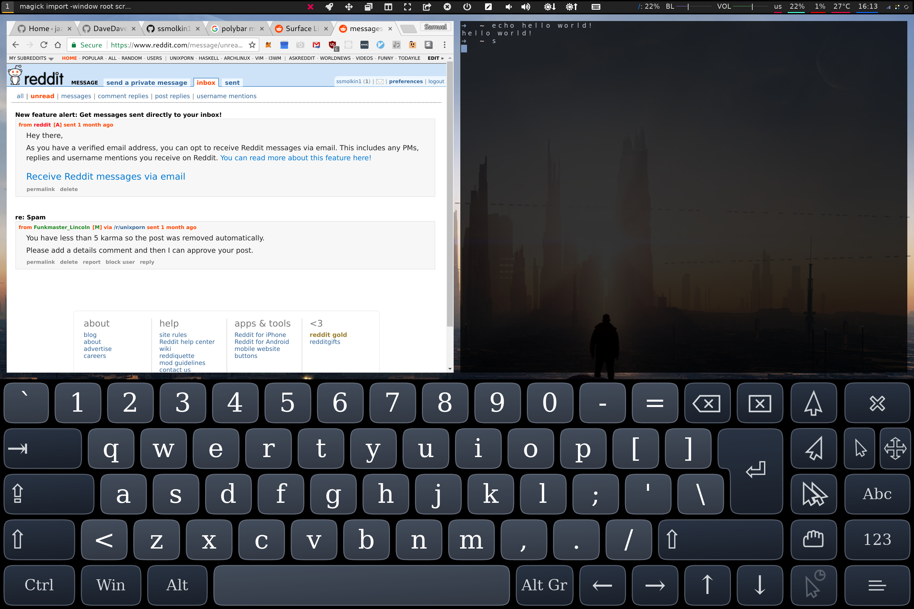

# i3 touch menu - a polybar module collection



Using a tiling window manager makes a lot of sense for a tablet. While that may seem unintuitive at first -- think about it: Android, iOS and Windows 10's tablet mode all use tiling wms. Thus, i3 is an excellent wm for tablets running GNU/Linux. The problem is that i3 is designed to be used with a keyboard, without a mouse, so there are no touch controls built in. For the many of us who use [polybar](https://github.com/jaagr/polybar) with i3, I've put together a menu with some useful touch commands. You'll want to customize them to make sure they work for your setup, but many of these should be reusable as-is. More on configuration below.

## Before you install
Assuming you already have `polybar` installed, you'll also need [fontawesome](https://github.com/FortAwesome/Font-Awesome).

You'll probably want on on-screen keyboard as well. By default, the keyboard button provided by this repo is set up to use `onboard`, which works well with i3 out of the box. More on configuration below.

## Installation
First, you'll want to configure polybar to work with font-awsome by putting something like this in your `~/.config/polybar/config`

```bash
font-3 = FontAwesome5Free:style=Solid:pixelsize=18:antialias=false;3
font-4 = FontAwesome5Brands:style=Solid:pixelsize=18:antialias=false;3
```

You can, of course, choose your own font size and other settings.

Next, you'll want to copy the contents of `i3touchmenu`, `touchredraw`, `touchvolume`, `touchbrightness` and `touchkeyboard` from this repo into  `~/.config/polybar/config`. You may only want some of these, but not all. In that case, just pick the ones you want.

Next, you'll want to initialize in `~/.config/polybar/config` by adding the names of these modules to `modules-left`, `modules-right`, or `modules-center`. You'll notice some of the icons are in quotes and have spaces around them. This is based on my own spacing preferences, and assumes that the modules will be added in the following order:

```bash
i3touchmenu touchredraw touchvoldown touchvolup touchbrightdown touchbrightup touchkeyboard
```

If you use a different order, the spacing will look off, so you'll want to change this to get it looking the way you want. Personally, I add these to `modules-center`. If you are going to do this as well, you may want to set `fixed-center = true`, so that the icons don't move around when your other modules change size.

## Configuration
When you're setting your own configurations, make sure to refer to the [polybar wiki](https://github.com/jaagr/polybar/wiki) pages on configuation and modules. These pages provide some very helpful information.

### touchkeyboard
I use `onboard` as my on-screen keyboard, and it works fairly well with i3 out of the box. I've configured onboard using `onboard-settings` to start hidden, and I launch it when i3 starts up by adding this to my `~/.config/i3/config`:

```bash
exec --no-startup-id onboard &
```
This will actually launch a tray icon that you can click to show and hide i3. However, I prefer to have a separate button for this next to my other touch controls, rather than in the tray. However, the `touchkeyboard` module only shows the keyboard, it won't hide it. However, the "compact" and "full" keyboard layouts have an "X" button in the right hand corner that will hide the keyboard, so that works well enough for me. 

### touchvolume and touchbrightness
I use `pactl` for audio controls and `xbacklight` for brightness. If you use something else, you will want to configure with the approriate commands. You can also adjust the increments/decrements from within the command.

### Launcher menu
In `i3touchmenu`, you will see that I've built a launcher sub-menu for launching a couple applicaitons which I use frequently. This is more of a reference than anything. You'll definitely want to add/remove/modify the entries in this menu so they launch the apps that you want them to.

### Working with fontawesome
When you are configuring these modules, you'll find that working with fontawsome can be a pain. If you use [rofi](https://github.com/DaveDavenport/rofi) (or are willing to install it for this purpose), I highly recommend using [this tool](https://github.com/wstam88/rofi-fontawesome) to make your life easier. I use launch it using the following command (which I've bound to a keyboard shortcut in i3):

```bash
/path/to/rofi-fontawesome/fontawesome-menu/fontawesome-menu -f /path/to/rofi-fontawesome/fontawesome-menu/fa5-icon-list.txt -o '-i -columns 4'
```

## Polybar issues
There are a few issues with `polybar` which need some special explanation.
### Rotation
If you use a tablet, you likely enable screen rotation. The problem is, `polybar` does not adjust it's width when you rotate the screen with `xrandr`. Hence, the `touchredraw` module. Clicking on this button will pass the `restart` command to i3 (what happens when you press `$mod+Shift+r`, assuming you're using the default keybinding). Using this command will, cause `polybar` to be redrawn to match the appropriate screen dimensions. It's not the fastest or most elegant solution, but the best I've been able to come up with so far.

### Running commands from polybar
You'll need to be careful to make sure any processes you launch from `polybar` are launched as background processes (i.e., they end with `&`). If run as a foreground process (i.e., without `&` at the end), then launching a process will cause `polybar` to be unresponsive to any further input until the process terminates. 
